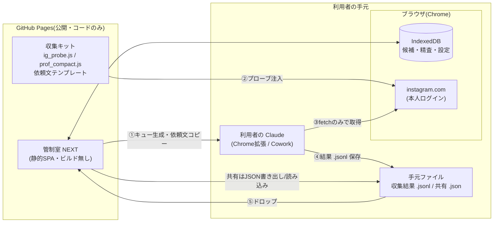

# キャスティング管制室 NEXT — 配布版 設計書 v1.0

作成日:2026-07-30
対象読者:実装者(Claude Code / Opus)およびオーナー

> ⚠️ **2026-08-03 の実装との差分（この文書は v1.0 のまま保存する。書き換えない）**
>
> 収集の方式が変わっています。**「依頼文をコピーして利用者の Claude に貼る」フローは撤去済み**で、
> 現在は同梱の **Casting Next 拡張(`extension/`)** が instagram.com のタブで直接収集します。
> したがって以下は**現行実装には存在しません**:
> §5-2 の依頼文生成ボタン ／ §8-3 依頼文テンプレート ／ §8-4 のプローブ配布UI ／
> `kit/request_template.md`・`kit/discovery_template.md`・`kit/qual_request_template.md`。
>
> 現行の受け渡しは localStorage の3キー(`castnext_cdp_discover` / `castnext_cdp_queue` / `castnext_cdp_qual`)と、
> 拡張から**ファイル入力への自動注入**です。現行の説明は `README.md` と `docs/guide.md` を正としてください。
> （§5-6 の精査対象「上位10名」も、現在は**スコア60点以上**に変更済み。[[Decision-Log]] 2026-08-03）

設計の前提資産:管制室 v1.4(SBIS v2.6)/ 発掘パイプライン v2.7 / 引き継ぎ書 run#6
UI参考:salus(anypill ADS MONITOR)— 左サイドバー・KPIカード・「要対応/確認」バッジ付きのやさしい言葉の自動診断アラート

---

## 0. この設計書の読み方

この文書だけで実装に着手できることを目標にしています。§1〜2 が「何を作るか」、§3〜7 が「どう作るか(画面・データ・ロジック)」、§8 が「AIブラウザ操作(収集)の設計」、§9〜12 が「配布・実装計画」です。

実装時の正は次の優先順です:①この設計書 → ②同梱の現行実装(`tool/stembeaute_casting_control.html`・`igf_scripts/`・`ingest_compact.py` ほか)→ ③引き継ぎ書 run#6。現行実装には run#1〜6 の運用で確定した判定ロジックと落とし穴対策が入っており、**ロジックは新規発明せず移植する**のが原則です(§7 に移植対応表)。

---

## 1. 背景・目的・確定要件

### 1-1. 現行システムと課題

現行は3点セットで動いています。

| 構成要素 | 形 | 課題 |
|---|---|---|
| 管制室 v1.4 | HTML1枚(1,892行)をローカルで開く | 配布のたびにファイルを渡す。更新が行き渡らない |
| 発掘パイプライン v2.7 | Pythonスクリプト群(Claudeセッション内で実行) | 利用者にPython環境と長い依頼文が必要。結果はCSV |
| ブラウザ取得 | Claude in Chrome でプローブJSを注入し内部APIをfetch | 手順が引き継ぎ書に散在し、属人化している |

分析結果(summary・落ち理由・機械合格)は CSV/JSON ファイルでしか見られず、管制室へのドロップも人手です。

### 1-2. 確定要件(2026-07-30 ヒアリング済み)

1. **提供先**:少数の知人・クライアント(数社〜数人)。アカウント管理は不要か最小限
2. **AIブラウザ操作**:利用者自身の Claude(Chrome拡張 / Cowork)で実行する。提供者が代行しない
3. **形態**:静的サイト(GitHub Pages)+ ブラウザ内処理。サーバ・DB・ログインなし
4. **分析結果は画面に表示**する(CSVファイル渡しを廃止。エクスポートは補助機能に降格)
5. **軽く動作**すること。**誰でも簡単に**使えること
6. UIは salus 参考:左サイドバー・KPIカード・**やさしい言葉の自動診断アラート(要対応/確認バッジ)**・ドーナツ等の軽いチャート

### 1-3. 設計の三原則

1. **コードは公開、データは各自のブラウザ**。GitHub Pages に置くのはコードだけ。候補者データ・精査メモ・エクスポートJSONは利用者のブラウザ(IndexedDB)と手元ファイルにのみ存在する。リポジトリにデータを一切コミットしない
2. **取得は各自の Claude・各自の Instagram アカウント**で行う。負荷・規約リスクを提供者に集中させない。フォロー・いいね・投稿は絶対にしない。
   ※DM送付のみ、オーナーの明示指示により `docs/設計書_DM自動一括送付_v1.0.md` の範囲(候補ボードでチェックした候補だけ)で解除している(2026-08-04)
3. **分析はブラウザ内で完結**。Python パイプラインの判定ロジックを JavaScript に移植し、「取得結果ファイルをドロップ → 画面に分析が出る」を1動作にする

---

## 2. 全体アーキテクチャ



**1周の流れ(利用者視点・5ステップ)**

1. 管制室 NEXT の「収集」画面で「今回の取得キュー(既定100件)」を作り、**依頼文コピー**ボタンを押す
2. 自分の Claude に貼り付ける(依頼文の中にプローブ入手先・手順・禁止事項がすべて入っている)
3. Claude が Instagram タブでプローブを注入し、fetch だけで取得して `run<N>_compact.jsonl` を返す
4. そのファイルを管制室 NEXT にドラッグ&ドロップ
5. その場でブラウザ内パイプラインが走り、**分析結果画面**(取得成績・落ち理由・機械合格一覧・定性一次判定・信頼性の自己申告)が表示され、機械合格者は候補ボードに自動追加される

CSVはこの流れのどこにも登場しません(必要な人向けに「書き出し」から出せるだけ)。

### 2-1. 静的サイトで成立する根拠

現行の管制室 v1.4 がすでに「サーバ無し・外部通信無し・localStorage 保存」で全機能を実現しており、追加するのは (a) Python パイプラインの JS 移植、(b) 画面の再構成、(c) 収集依頼文の自動生成、の3点だけです。いずれも純粋なクライアント処理で、100件/run 規模のデータ量(JSONL で数百KB)はブラウザ内処理に十分収まります。

---

## 3. 技術選定

| 項目 | 選定 | 理由 |
|---|---|---|
| フレームワーク | **なし(vanilla JS + ES Modules)** | 現行1,892行が vanilla で成立済み。ビルド工程ゼロ=リポジトリに push すれば即デプロイ。「軽く動作」の最短経路 |
| ビルド | **なし** | `index.html` + `js/*.js` + `css/*.css` をそのまま Pages で配信。実装者(Claude Code)にとっても差分が追いやすい |
| ルーティング | ハッシュルーティング(`#/dash` 等) | Pages はサーバ側リライト不可。1画面=1モジュール |
| チャート | **自前SVG**(ドーナツ・横棒・スパークラインの3種のみ) | Chart.js 等のCDN依存を避け、初期ロードを最小化。必要な図は3種で足りる(§5) |
| 保存 | **IndexedDB**(`idb-keyval` 相当を自前実装・50行程度)+ localStorage(設定など小物) | 現行の localStorage 一本から移行。数千候補・複数プロジェクトでも量子化しない。**現行v3 JSONの読み込み互換を必ず維持**(§4-4) |
| CSVパース | 現行 `parseCsv()` を移植 | 実績あり(BOM・引用符対応済み) |
| 文字処理 | NFKC 正規化(現行 `nfkc()`)・サロゲート単体除去 | run#6 の落とし穴対策を継承 |
| テスト | Node 上でロジック層のみ単体テスト(`node --test`)+ ヘッドレス検証スクリプト | 現行 `verify_v14_run6.py` の11項目 + igfinder 217件のうち移植対象分を JS に移す(§7-4) |
| 対応ブラウザ | Chrome / Edge 最新(収集に Chrome 拡張が必須のため、Chrome を正式対応とする) | Safari の localStorage/IndexedDB 制限問題を仕様外にできる |

**サイズ目標**:初期ロード合計 ≤ 300KB(非圧縮)・外部CDN依存 0・Lighthouse Performance 95+。フォントはシステムフォントスタック。

---

## 4. データモデル

### 4-1. ストア構成(IndexedDB `castnext` / バージョン1)

```
projects   : { id, name, brandName, preset, createdAt, params }   // §10 マルチプロジェクト
candidates : { projectId+username を複合キー, ...candidate }
runs       : { projectId+runTag, summary, ingestedAt, reliability }
coverage   : { projectId, rows[] }                                 // 探索カバレッジ表
oplog      : { projectId, entries[] }                              // 指示書外判断の運用ログ
queue      : { projectId, pending[], done[] }                      // 取得キュー(rank_queue移植)
meta       : { schemaVersion, activeProjectId }
```

### 4-2. candidate(現行v3スキーマを継承・拡張)

現行 `newCand()` + CSV16列 + 一次コメント3列 + 定性6列(v2.7の25列)をそのままフィールド化し、以下を追加します。

| 追加フィールド | 内容 |
|---|---|
| `runTag` | どの run で入ったか(分析結果画面との相互リンク用) |
| `stanceHistory[]` | 語りの向きの判定履歴(再取得で変わったとき追跡できるように) |
| `qualReport` | §6-6 精査画面の構造化データ(現行 `qual_report.py` の md をフォーム化したもの) |

現行の SBIS 採点フィールド(`score` / `s2`(T1〜T5+証拠メモ) / `s3` / `sig` / `growth` / `slot` / `status` / `legacy_*`)は**名前・意味とも変更しない**。移行互換の要です。

### 4-3. run(分析結果の正体・CSV廃止の中核)

`ingest_compact.py` が summary_<tag>.json に出していた内容+全件の判定結果を、ファイルではなくストアに持ちます。

```js
run = {
  runTag: "run7",
  ingestedAt, sourceFile,           // ドロップされた .jsonl の名前
  attempts, succeeded, failures: {reason: count},
  inBand, machinePassed, purityExcluded,
  signals: {生活者, 他社契約, 業者},
  dropReasons: {reason: count},      // 落ち理由の内訳(横棒チャートの元)
  rateLimited,
  reliability: {avgCaptionLen, prSource, verdict, stanceBreakdown},  // v2.7 の自己申告
  reviewNeeded: [username...],
  rows: [ {username, verdict: "passed"|"rejected"|"quarantined", reasons[], metrics...} ]
}
```

### 4-4. 移行互換(必須要件)

- 現行 v1.4 の **JSON書き出しファイル(v3)を「読み込み」からそのまま取り込める**こと。`applyData()`/`migrate()` の変換ロジックを移植し、`legacy_s2` / `legacy_checks` の温存仕様も維持する
- 現行 25列 CSV(`matched_run6.csv` 形式)のドロップも引き続き受け付ける(過去 run の取り込み用)
- 書き出しは v4 形式(プロジェクト単位の全量JSON)とし、v4 → 現行 v1.4 への逆方向互換は**保証しない**(片方向)

---

## 5. 画面設計

### 5-0. 共通シェル(salus 準拠)

- **左サイドバー固定**(ブランドカラーの縦グラデーション)。上からロゴ/プロジェクト名、ナビゲーション(実績系→分析系→設定系の3グループ)、最下部に保存状態インジケータ

**カラートークン(css/tokens.css)**:ステムボーテ企画書「週次抽選販売モデル」から抽出した以下を既定パレットとする。トークンはプロジェクト設定(§10)で上書き可能にし、プリセットにテーマ色を含める(他ブランド展開時は色ごと切り替わる)。

| トークン | 値 | 用途(企画書での使われ方を踏襲) |
|---|---|---|
| `--brand-950` | `#2B2430` | 本文インク(プラム系の墨) |
| `--brand-900` | `#4A1F33` | 最深ベリー(サイドバーグラデ終点・強調) |
| `--brand-700` | `#6D2E46` | **主色**(ベリー。選択状態・リンク・主要チャート) |
| `--brand-500` | `#A26769` | ダスティローズ(第2チャート色) |
| `--brand-100` | `#FBEAF0` | ピンクティント(バッジ背景・強調行) |
| `--gold` | `#B98A2E` | ゴールド(アクセント・「確認」バッジ) |
| `--bg` / `--line` | `#F6F0E9` / `#E8DFD5` | 背景(生成りのクリーム)/罫線 |
| `--sub` | `#857A82` | 補足テキスト(モーヴグレー) |
| セマンティック | 赤 `#C14E62`・金 `#B98A2E`・緑 `#4E8D6B` | 要対応/確認/良好、🔴🟡🟢シグナル(意味色はブランド外でも維持し、彩度をパレットに寄せる) |

サイドバーは `#7A3550 → #3A1A2A` の縦グラデーション。カードは白+プラム系の淡い影(`rgba(58,32,44,.07)`)。企画書と同じ「濃ベリーの面+クリーム地+白カード」の三層で組む。
- ヘッダ右に**プロジェクト切替**と**run切替**(salus の期間プリセットに相当する位置)
- メイン領域は白背景+カード。数値カードは「大きな数値+前回比▲▼+補足1行」の salus 形式
- **自動保存バナー**は現行仕様を継承(緑=有効/黄=無効。無効時は書き出し必須の警告)

ナビゲーション構成:

```
[実績]   概要 / 候補ボード / パイプライン(カンバン)
[分析]   分析結果(run別) / 精査・定性評価 / 探索カバレッジ / 敗者復活
[運用]   収集(キューと依頼文) / データ入出力 / 設定・基準 / 運用ログ
```

### 5-1. 概要(ダッシュボード)

salus の「概要」に対応する初期画面。3段構成。

**①KPIカード列(6枚)**:候補総数 / 帯内 / 機械合格 / 精査待ち(得点率順) / 契約 連載枠 x/4(内訳ミドルy+成長マイクロz) / 契約 都度枠 x/10。各カードに前回run比の▲▼。

**②自動診断アラート**(本設計の目玉。§5-1b)

**③次のアクション+ミニチャート**:精査待ち上位5名(得点率・救済バッジ付き)、シグナル内訳ドーナツ(🟢生活者/🟡他社契約/🔴業者)、語りの向き内訳ドーナツ。

### 5-1b. 自動診断アラートの設計

salus のアラート(キャラクター+平易な一言+バッジ+根拠+誘導先)をそのまま踏襲します。**すべてのアラートは「バッジ/平易な見出し/根拠の数値/どの画面で何をすればよいか」の4点セット**で表示し、クリックで該当画面に飛びます。

バッジは3段階:**要対応**(赤・作業がブロックされている/品質が壊れている)/**確認**(黄・判断が必要)/**情報**(グレー・知っておくべき変化)。

現行ツール+run#6 の教訓から、初期実装するアラートは次の12本です。

| # | バッジ | 発火条件(現行ロジック由来) | 表示文言の例 |
|---|---|---|---|
| A1 | 要対応 | 探索カバレッジに未実行行が残っている | 「計画した探索のうち◯行がまだ実行されていません。未実行を隠さないのがこの表の目的です → カバレッジ」 |
| A2 | 要対応 | run の `reliability` が ⚠(キャプション平均<140字 等) | 「今回の取得はキャプションが短く、定性判定が過小に出ています。プローブ設定を確認して再取得を → 収集」 |
| A3 | 要対応 | DM送付日超過(営業日計算・判断16修正済みロジック) | 「返信待ちが期限を越えた候補が◯名います → パイプライン」 |
| A4 | 要対応 | 救済(SBIS-1s)候補がコメント質確認の形跡なくDM送付以降にいる | 「いいね非表示の候補がコメント質の確認前に先へ進んでいます → 候補詳細」 |
| A5 | 要対応 | 適合コメント空のままDM送付に動かそうとした(操作時) | 「『なぜこの人か』が書かれていません。3〜5文・懸念1つが必須です」 |
| A6 | 確認 | 運用ログに「提案中」が残っている | 「承認待ちの判断が◯件あります → 運用ログ」 |
| A7 | 確認 | review_needed(verified×カテゴリnull)の目視が未了 | 「機械で判定しきれなかった◯名の目視確認が残っています → 分析結果」 |
| A8 | 確認 | T1タイアップ比率50%超の候補が候補ボードに滞留 | 「紹介者バッジの候補が◯名います。原則見送りです → 候補ボード」 |
| A9 | 確認 | 純度未評価(フォロー数なし)の候補が精査待ち上位にいる | 「フォロー数が取れていない候補が上位にいます。再取得で純度評価ができます」 |
| A10 | 確認 | rate_limited > 0 の run がある | 「前回の取得でレート制限が◯件出ました。取得ペースを落としてください → 収集」 |
| A11 | 情報 | 純度評価済み40件超で相関が算出された | 「following×ER の相関が出ました。減点幅の見直し材料です → 設定・基準」 |
| A12 | 情報 | biz疑い隔離(判断22)を自動実行した | 「業者疑い◯件を取得後隔離しました。リストは分析結果に残っています」 |

文言のトーンは「責めない・次の一歩を必ず示す・数値の根拠を添える」。キャラクターは任意(プロジェクト設定でON/OFF)。

### 5-2. 収集(キューと依頼文)— 新設画面

AIブラウザ操作の入口。詳細な手順仕様は §8。画面要素は次の4ブロック。

1. **キュー生成**:プール残数(取得済み除外後)を表示し、「今回の取得キューを作る(既定100件)」ボタン。`rank_queue.py` v2.6 の並べ替えロジック(取得済み除外込み・**列名バグ修正済みの版**)を移植。生成結果はハンドル一覧として画面に出し、queue ストアに保存
2. **依頼文の生成とコピー**:キュー+プロジェクト設定から**完全な依頼文**(§8-3)を組み立てて1ボタンでコピー。「Claudeに貼り付けてください」の案内と、初回向けの「準備チェック」(Chrome拡張・IGログイン・拡張の権限)へのリンク
3. **結果ドロップ**:`.jsonl` / 25列CSV のドロップ領域。ドロップ即解析(§7)→ 分析結果画面へ自動遷移
4. **取得履歴**:run一覧(日時・件数・成功率・rate_limited)。`job_in_done` 相当(取得済み台帳)はここで管理し、キュー生成時の除外に使う

### 5-3. 分析結果(run別)— 新設画面・CSV廃止の中核

`summary_<tag>.json`+落ちた全件の内訳を画面化します。run切替タブ付き。

- **取得成績カード**:試行/成功/欠測(欠測>0なら「再取得で復旧できます」の親切文言と手順リンク=引き継ぎ書の schema_error 復旧知見)
- **ファネル図(横棒)**:取得100 → 帯内35 → 純度ゲート通過 → 機械合格13 のように段階で減っていく様子
- **落ち理由の横棒チャート**:`dropReasons` 降順。各バーをクリックすると該当ハンドル一覧(理由付き)が展開
- **シグナル内訳ドーナツ**+**語りの向き内訳ドーナツ**
- **信頼性の自己申告カード**:v2.7 の `定性列の信頼性` をそのまま表示。⚠なら赤枠+A2アラート連動
- **機械合格一覧テーブル**:25列のうち画面で意味のある列(得点率・stance・声の特徴・根拠引用・懸念)を整形表示。「候補ボードに追加済み」バッジ。行クリックで候補詳細へ
- **隔離・review_needed 一覧**:biz疑い(判断22)と review_needed を「黙って捨てない」原則どおり明示
- 右上に「CSV/JSONで書き出す」(補助機能。既定は画面表示のみ)

### 5-4. 候補ボード+候補詳細

現行「候補リスト」タブの移植+詳細画面の整理。一覧はティア/契約枠/ステータス/第0候補/足切り表示のフィルタ、**得点率順ソート既定**、救済バッジ(/75表示)・紹介者バッジ・純度バッジ(🔴🟡🟢/未評価)を継承。

詳細画面は現行の全要素を3カラムに再配置:左=プロフィール数値と SBIS-1 内訳(純度減点・救済採点の適用が読める形)、中=証言力rubric T1〜T5(証拠メモ必須・T1自動採点・T3のNG突合とロック・作法語検出、**すべて現行ロジックそのまま**)、右=適合コメント(4要素テンプレート付き)・契約枠・連載枠適格判定・ステータス。

### 5-5. パイプライン(カンバン)

現行踏襲(ステータス列でのドラッグ)。DM送付へのドラッグは適合コメント空でブロック(A5)。DM送付日から営業日カウントで返信期限を表示(祝日非対応は既知の制限として画面に注記)。

### 5-6. 精査・定性評価 — 新設画面(`qual_report.py` の画面化)

精査は **2名/回の上限**をUIで支える(3人目を開こうとすると「まとめてやると精査の質が落ちます」と確認を挟む)。

- **⓪ 精査データの収集依頼(2026-07-31 追加)**:画面上部の
  **「精査データ依頼文を作ってコピー」**ボタンで、**精査待ち上位10名**(得点率順・足切り/対象外帯/
  第0候補/精査済み/見送りを除く)のハンドルを埋めた収集依頼文を生成する。
  テンプレートは `kit/qual_request_template.md`(§8-3 の「精査データ収集モード」節を独立させたもの)。
  - **なぜ別経路が要るか**:通常取得のキャプションは140字で切り詰めてある(`__CAP`)。
    精査は**キャプション全文・コメント欄・bio全文**が要るため、精査対象だけ改めて集める
  - 依頼文には 3ファイルの書式見本(見出し行の形まで)・`taken_at` 降順・**本人返信は全文**・
    コメントは上位4投稿×最大50件・bio全文必須(渡さないと自己開示を取りこぼす)・
    禁止事項(DM/フォロー/いいね/UA偽装/遷移)・429での中断・推測記入の禁止を含める
  - 収集依頼は10名まとめて出してよい(取得は機械作業)。**精査そのものは2名/回**の上限を維持する
- **入力**:精査データ3ファイル(`captions.txt` / `comments.txt` / `profile.txt`、形式は現行 §5-3 と同一)をドロップ。パースは「行全体が `---` の行だけを区切りにする」修正済みロジックを移植
- **自動生成部**:語りの向き一次判定+根拠引用/シグナル別引用/コメント欄の「読者の質問→本人の返信」ペア・本人返信ユニーク率/投稿の並び(日付・いいね・コメント・PR)
- **人が書く欄**:md の空欄をフォーム化(判定に同意するか/効いている一文と理由/返信は宣伝か当事者か/結論=役割・魅力一文・懸念1つ)。**未記入のまま「精査完了」にできない**(現行「空欄のまま提出しない」の強制化)
- 完成した定性評価は候補詳細に紐づき、md としても書き出せる

### 5-7. 探索カバレッジ/敗者復活/データ入出力/設定・基準/運用ログ

いずれも現行タブの移植。変更点のみ:

- カバレッジの「既定行を投入」はプロジェクト設定のキーワード群から生成(ステムボーテ固定を解消)
- 設定・基準:採点パラメータ変更に「理由+バージョン表記」を強制する現行仕様を維持。**プロジェクト設定**(§10)をここに統合
- データ入出力:v3 JSON読み込み(移行)/v4 JSON書き出し・読み込み(共有)/自動保存データ消去

---

## 6. ブラウザ内分析パイプライン(Python → JS 移植)

### 6-1. 移植対応表

| 現行(Python) | 新(JS モジュール) | 移植の要点 |
|---|---|---|
| `ingest_compact.py` | `js/pipeline/ingest.js` | `to_record()` のキー(`h/u/p/cap/capl/prl/l/c/lv/cd/fg`…)は **prof_compact.js と1対1のまま変えない**。いいね非表示は null(0扱いしない)・開放投稿3件未満で avg_comments 不明・ER/コメント率の丸め桁も一致させる |
| `igfinder/filters.py` | `js/pipeline/filters.js` | `EVALUATION_ORDER` の評価順を維持。**純度ハードゲート(following_max=3000 / ff_ratio_min=2.0)を含む**。未知キーは素通りさせずエラー(run#6 不具合3の再発防止) |
| `igfinder/qualsignals.py` | `js/pipeline/qualsignals.js` | 10シグナル。**語ではなく当たった文そのものを返す**。stance判定は「導線の有無を先に見る」構造を維持(営業導線は当事者性で相殺しない)。「予約」単体は導線にしない/「¥649」形式の価格を拾う/bio抽出は `[biography` 明示、の修正3点を含めて移植 |
| `igfinder/fitcomment.py` | `js/pipeline/fitcomment.js` | select_reason / fit_comment / fit_concern の4要素+定性2文。引用の判定件数は表示上限(3件)と切り離す |
| `postscreen_biz.py` | `js/pipeline/postscreenBiz.js` | 判断22(取得後隔離)。隔離リストは run に記録し画面表示(黙って捨てない) |
| `rank_queue.py` | `js/pipeline/rankQueue.js` | **取得済み除外の照合キーは username**(run#6 不具合1の修正を固定)。プール残数を返す |
| `qual_report.py` | `js/pipeline/qualReport.js` | md 生成ではなく §5-6 の構造化データを返す。md書き出しは view 側 |
| `screen_brand.py` | `js/pipeline/screenBrand.js` | ブランド公式疑いの隔離(E1収集結果向け) |
| SBIS採点(HTML内 `scoreSbis1` 等) | `js/pipeline/sbis.js` | 現行HTMLから**関数単位でそのまま移す**(ティア別正規化・純度減点合算−15上限・SBIS-1s /75・得点率) |
| 共通ユーティリティ | `js/pipeline/util.js` | `parseCsv` / `nfkc` / サロゲート単体除去 / 営業日計算 / `toNum`・`toBool` |

pipeline 層は **DOMに触れない純関数のみ**で構成し、Node の `node --test` で回帰テストを回せるようにします(ブラウザとNodeの両方で import できる ES Modules)。

### 6-2. 判定ロジックで絶対に守ること(run#1〜6 の血で書かれたルール)

1. 営業導線は当事者性で相殺されない(run#6の権威型ケース)
2. 「予約」単体では導線にしない(run#6の生活者ケース)
3. PR判定は**全文で判定済みの真偽値(`prl`)を使う**。切り詰め後テキストから `#PR` を数え直さない
4. いいね非表示(`lv`)の投稿の likes は null。0で埋めない。ER不能なら SBIS-1s(/75)へ
5. タイアップ比率50%超で紹介者(ちょうど50%は該当しない)/ NG含有投稿2件以上で常習(同一投稿内の複数NG語は1件)
6. フィードの返却順は taken_at 順ではない。**taken_at 降順に整列してから直近12件を確定**(取得側=依頼文にも明記)
7. 判定不能は「不明」であり0ではない(純度未評価は減点しない、SBIS-3 は推測記入禁止)

### 6-3. 回帰テストの移植

`igf_scripts/tests/test_qualsignals.py` の固定値回帰10件(run#6 の人の結論を固定したもの)を最優先で JS に移植します。加えて、`成果物_run6/` の実データから**ゴールデンテスト**を作ります:run#6 の生 JSONL(または matched_run6.csv の元データ)を fixture に、JS パイプラインの出力が Python 版の出力(機械合格13名・stance内訳・落ち理由内訳)と一致することを CI(GitHub Actions・push時)で検証します。**このテストが通るまで移植完了としない**のが本設計の受け入れ基準です。

---

## 7. リポジトリ構成

```
casting-next/                       # 公開リポジトリ(データを置かない)
├── index.html                      # シェル(サイドバー+ルータのみ)
├── css/  app.css tokens.css        # tokens.css = §5-0 のブランドパレット(プロジェクトで上書き可)
├── js/
│   ├── app.js  router.js  store.js # store.js = IndexedDB ラッパ+v3移行
│   ├── views/                      # 画面ごとに1ファイル(dash/collect/analysis/
│   │                               #   board/detail/kanban/qual/coverage/revive/io/settings/oplog)
│   ├── pipeline/                   # §6 の純関数群(DOM非依存)
│   ├── alerts.js                   # §5-1b の発火条件を1箇所に集約
│   └── charts.js                   # 自前SVG(donut/hbar/sparkline)
├── kit/                            # 収集キット(§8。サイトから配信)
│   ├── ig_probe.js                 # 現行版をそのまま配置(改変しない)
│   ├── prof_compact.js             # 同上(__CAP=140・prl 込み)
│   └── request_template.md         # 依頼文テンプレート(プレースホルダ入り)
├── presets/
│   └── stembeaute_v26.json         # ステムボーテ設定一式(§10)
├── tests/                          # node --test(回帰10件+ゴールデン+SBIS)
│   └── fixtures/                   # run#6 由来fixture(公開可能な形に匿名化する。§11-2)
├── docs/                           # 利用者向けガイド(§9。サイト内ヘルプと同内容)
└── .github/workflows/test.yml      # push時に node --test
```

---

## 8. AIブラウザ操作(収集)の設計 — 本設計の中核

### 8-1. 前提と役割分担

| 役者 | 持ち物 | やること |
|---|---|---|
| 利用者 | Chrome+Claude(Chrome拡張 or Cowork)+自分のIGアカウント | 依頼文をコピペし、返ってきたファイルをドロップする。**それだけ** |
| 利用者の Claude | — | 依頼文に従いプローブ注入→fetch取得→JSONL生成 |
| 管制室 NEXT | キュー・依頼文・解析 | 依頼文の中身を毎回正しく組み立てる(人が手順を覚えない) |

手順の知識(遷移禁止・15〜20件ずつ・リトライ・整列規則…)は**すべて依頼文に内蔵**します。引き継ぎ書を読んだ人しか取得できない現状を、「依頼文が引き継ぎ書の役割を果たす」形に変えるのがこの設計です。

### 8-2. 収集の技術方式(現行を維持)

- Claude in Chrome の `javascript_tool` で `kit/ig_probe.js` → `kit/prof_compact.js` の順に注入し、`window.IGF` / `window.__PROF` を定義
- 取得は**ページ内 fetch のみ**(Cookie/CSRF/App-ID が自動で乗る)。1アカウント=1〜2リクエスト
- **ページ遷移をしない**(遷移すると `window.IGF` が消える)
- `computer` 操作(クリック/スクロール)は最終手段。UA偽装によるモバイル専用エンドポイント回避は**しない**
- 結果は `window.__R` に貯め、**15〜20レコードずつ**ダンプして JSONL 化(1レコード ≒ 1.8KB)

### 8-3. 依頼文テンプレート(`kit/request_template.md`)の構成

管制室 NEXT がプレースホルダを埋めて生成します。章立てと必須内容:

1. **あなたへの依頼**:「以下の◯件の Instagram アカウントの公開プロフィール・直近投稿の数値を、注入プローブの fetch だけで取得し、JSONL で返してください」
2. **禁止事項(最上部に明記)**:フォロー・いいね・投稿・コメントを絶対にしない/UA偽装をしない/ページ遷移最小限/`computer`操作は最終手段
   (DM送付は `docs/設計書_DM自動一括送付_v1.0.md` の経路のみ。収集・発掘・精査の経路では一切しない)
3. **手順**:①instagram.com のタブを開く(ログイン確認)②`{KIT_URL}/ig_probe.js` と `{KIT_URL}/prof_compact.js` の内容を取得してそのまま評価(**1文字も変えない**。`window.__CAP` が140未満なら中止して報告)③対象ハンドルごとに `IGF.profile(handle)` → `__PROF(res, tags, src)` → `__R` に蓄積 ④15〜20件ごとにダンプ
4. **対象リスト**:`{HANDLES}`(タグ・出所付き)
5. **ペースとエラー処理**:リクエスト間に間隔を置く/HTTP 429 や rate_limit 兆候が出たら**即中断して件数を報告**(取り直しは管制室がキューを再生成する)/`schema_error` は同一セッション内でプローブ再注入→再取得(run#6 で 20/20 復旧の実績)/1周目の欠測は必ずリトライ
6. **データ規則**:フィードは taken_at 降順に整列してから直近12件/サロゲート単体は除去/キャプション欠けはIG側仕様として注記
7. **30件時点の中間チェック**:帯内({BAND_MIN}〜{BAND_MAX})が5件未満なら中断して報告(タグ選定の失敗を100件分浪費しない)
8. **成果物の形式**:`{RUN_TAG}_compact.jsonl`(1行=`__PROF` 1レコード)+末尾に取得サマリ(試行/成功/欠測/rate_limited)を人向けに報告
9. **精査データ収集モード(オプション節)**:精査対象について captions/comments/profile の3ファイルを §5-3 形式で作る指示(コメント欄は上位4投稿×最大50件・本人返信は全文・bio必須)
   - **実装では独立したテンプレート `kit/qual_request_template.md` に切り出した(2026-07-31)。**
     精査データは取得(140字)とは別タイミング・別対象で集めるため、取得依頼文に混ぜると
     「今回はどっちを頼まれているのか」が曖昧になる。精査・定性評価画面(§5-6 ⓪)の
     **「精査データ依頼文を作ってコピー」**が、精査待ち上位10名を埋めて生成する

依頼文は Claude のバージョン差に耐えるよう、「なぜそうするか」の理由を1行ずつ添えます(理由があると逸脱が減る)。

### 8-4. プローブ配信の注意

- GitHub Pages は CORS 制約なしで raw テキストを配れるため、Claude は fetch でキットを取得できる。取得できない環境向けに、収集画面に「プローブ全文をコピー」ボタンも用意する(依頼文に貼り込む代替経路)
- `prof_compact.js` のキー名は ingest と1対1(1文字変えると壊れる)。**キットの改変検知**として、依頼文に「`__CAP` と `__PRRE` の存在を評価結果で確認してから開始する」チェックを含める
- キット更新時は `kit/version.json` を更新し、JSONL 先頭レコードにプローブ版数を記録 → 解析時に不一致なら A2 系アラート

### 8-5. うまくいかないときの分岐(依頼文と画面ヘルプの両方に記載)

| 症状 | 対応 |
|---|---|
| Chrome拡張が繋がらない | 準備チェック画面へ誘導(拡張インストール・サイト権限・IGログインの3点確認) |
| rate_limited が出た | その run は打ち切り、翌日以降に残りを再キュー(取得済み除外が効くので重複しない) |
| 欠測が出た | プローブ再注入→再取得(users_info 経路で復旧する旨を依頼文に記載) |
| JSONL がドロップで弾かれる | 形式検査の結果を平易に表示(「◯行目のレコードに `u` がありません」)。Claude に渡し返す用のエラーメッセージをコピーできるボタン |

---

## 9. オンボーディング(誰でも簡単に、の実装)

### 9-1. 初回セットアップウィザード(初回アクセス時に自動起動)

1. **プロジェクト作成**:ブランド名を入れる or プリセット(ステムボーテ v2.6)を選ぶ
2. **準備チェック**:Chrome か/Claude 拡張が入っているか(導線リンク)/IG にログインしているか — 各項目「できたらチェック」の自己申告式
3. **サンプルで試す**:同梱の匿名化サンプル JSONL をワンクリックでドロップ体験 → 分析結果画面がその場で出る(**実データの前に成功体験を作る**)
4. **最初の収集へ**:収集画面に誘導

### 9-2. 画面内ヘルプ

各画面の右上に「?」。`docs/` の該当節をモーダル表示(外部サイトに飛ばさない)。用語(SBIS・得点率・救済・紹介者・stance)はツールチップで即席解説。

### 9-3. 提供者(あなた)の配布手順

リポジトリを Pages で公開 → 利用者に URL を1本送る、で完了。更新は push だけで全員に行き渡る(HTML1枚配布の更新問題が消える)。プロジェクトデータは各自のブラウザにあるため、**あなたの手元に利用者のデータは来ない**(サポート時は v4 JSON を送ってもらう)。

---

## 10. 汎用化(マルチプロジェクト)

ステムボーテ固定値を「プロジェクト設定」に外出しします。プリセット `presets/stembeaute_v26.json` が現行値の正です。

| 設定群 | 内容(現行値の出所) |
|---|---|
| 帯定義 | micro/middle の followers 範囲・メガ帯閾値(ジョブ定義 v4) |
| 機械フィルタ | ER下限・平均コメント下限・comment_rate_min・genre_exclude・言語・純度ゲート(ingest_compact.py 冒頭の定数) |
| 探索キーワード | E1 行動タグ+生活文脈タグ・E2 検索語(job_*_v4.jsonc) |
| SBIS パラメータ | ティア別正規化・純度減点・救済採点・重み(管制室 conf) |
| NG語・作法語辞書 | T3 突合辞書(薬機法はステムボーテ固有。**他業種プリセットでは差し替え前提**と明記) |
| 契約枠の目標 | 連載4(内訳)+都度10 |
| 文言 | ブランド名・アラートのキャラクターON/OFF |

新プロジェクトは「プリセット複製→編集」。基準変更に理由+バージョン表記を強制する現行仕様は、プロジェクト設定にも適用します(§7-3 の思想を汎用化)。

**注**:qualsignals のシグナル辞書(自己開示・営業導線など)は日本語の美容・生活文脈に最適化されています。初版では「美容系プロジェクト向け」と正直に明記し、辞書のプロジェクト別上書きは v2 の拡張候補とします(§13)。

---

## 11. 非機能要件

### 11-1. 軽量性

初期ロード ≤300KB・依存CDNゼロ・1,000候補で一覧描画 100ms 以内(仮想スクロールは行わず、フィルタ後表示件数を既定200件+「さらに表示」で対応)。解析(100件JSONL)は 1秒以内(実測ベースで十分達成可能)。

### 11-2. プライバシー・公開の安全

- 公開リポジトリに置いてよいもの:コード・キット・匿名化fixture・ドキュメント。**置いてはいけないもの:実在ハンドルの取得データ・精査メモ・クライアント名入り設定**
- tests/fixtures は run#6 データを**ハンドル置換・数値摂動**で匿名化して作る(ゴールデンテストの照合値も匿名化後の値で固定)
- 収集データはブラウザ内のみ。書き出しJSONの共有は利用者の責任範囲であることを docs に明記

### 11-3. Instagram 利用上の注意(docs に利用者向けの言葉で記載)

自分のアカウントで公開情報を閲覧する範囲の取得であること、自動化には凍結等のリスクがゼロではないこと、ペース制限を依頼文が守ること、能動操作は「人がチェックした候補へのDM送付」に限られること(フォロー・いいね・投稿はしない)。**リスクの引き受け主体は利用者**である旨を配布時に合意しておく(提供者の免責)。

> ⚠ DM送付は読み取りと危険度が異なる書き込み操作であり、凍結リスクは収集より高い。
> レート制御・日次上限・キルスイッチ・重複ガード・監査ログは必須要件(設計書_DM自動一括送付 §6)。

### 11-4. 既知の制限(引き継ぎ)

営業日カウントは祝日非対応/E2 は1語5件上限・E3(chaining)は現行経路で不可/`get_page_text` のタブ潰し等の取得系の落とし穴は依頼文側で吸収。

---

## 12. 実装フェーズ計画(Claude Code 向け)

各フェーズに**完了条件(検証)**を付けます。フェーズ内は1PR=1モジュール粒度を推奨。

| フェーズ | 内容 | 完了条件 |
|---|---|---|
| **P0 足場** | リポジトリ・シェル(サイドバー+ルータ)・store.js(IndexedDB+v3移行)・CI | v1.4 の JSON書き出しを読み込み、候補件数・SBIS合計が v1.4 と一致 |
| **P1 パイプライン移植** | `js/pipeline/*` 全部+回帰10件+ゴールデンテスト | **run#6 fixture で Python 版と出力一致**(機械合格13・stance内訳・落ち理由内訳)。`node --test` 全緑 |
| **P2 分析結果画面** | 収集画面のドロップ→解析→分析結果画面(§5-3)・charts.js | run#6 JSONL をドロップして summary_run6.json と同値が画面に出る |
| **P3 候補ボード・詳細・カンバン** | §5-4/5-5 の移植(rubric・ブロック・バッジ) | 現行 `verify_v14_run6.py` の11項目を JS 版ヘッドレステストに移植して ALL PASS |
| **P4 収集キットと依頼文** | キュー生成・依頼文生成・準備チェック・kit配信 | 生成した依頼文だけを新規 Claude セッションに渡し、3件の実取得→ドロップ→候補追加が通る(人手の追加説明ゼロで) |
| **P5 アラート・カバレッジ・運用ログ・敗者復活** | §5-1b の12本+残り画面 | 各アラートの発火条件をfixtureで単体テスト |
| **P6 精査・定性評価画面** | §5-6(3ファイルドロップ→フォーム) | run#6 の実3ファイルで、`qual_report.py` 出力と同内容が画面に出る+未記入で完了不可 |
| **P7 オンボーディング・docs・磨き** | ウィザード・サンプル体験・ヘルプ・文言 | 初見者テスト:URL を渡すだけで最初の分析表示まで到達できる |

P2 完了時点で「ドロップ→画面表示」の中核価値が動くため、**P2 でオーナーレビューを挟む**ことを推奨します(salus 的な見た目の当て感をここで合わせる)。

---

## 13. 未決事項・v2 拡張候補

1. **E2/E3 の探索拡張**(account_serp 直叩き・関連アカウントUI由来サーフェス)は本設計の範囲外。収集は E1 タグ経路を正とする(実測で帯内率2倍の生活文脈タグ優先)
2. qualsignals 辞書のプロジェクト別上書き(他業種展開時)
3. 複数人同時編集(現状は JSON 受け渡し。需要が出たら CRDT や共有バックエンドを検討 — 三原則1を破るので慎重に)
4. 祝日対応の営業日カウント
5. 依頼文の多言語化・Claude 以外のエージェント対応
6. salus のキャラクター相当のイラスト素材(初版はバッジ+文言のみで成立させる)

---

## 付録A. 現行資産の取り扱い

- `tool/stembeaute_casting_control.html`(v1.4)は**凍結**(参照実装)。採点・移行ロジックの移植元として読む
- `igf_scripts/` は判定ロジックの正。移植時に**仕様を変えない**(変えたくなったら運用ログと同じく「提案」として扱う)
- 引き継ぎ書 run#6 §6「やってはいけないこと」は本システムでも全文有効
